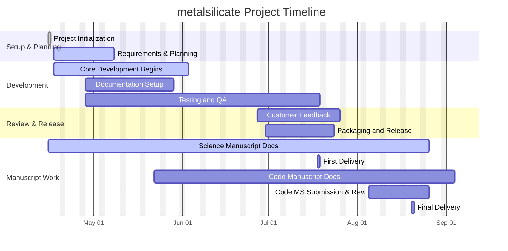

# metalsilicate
Python library for processing a metal-silicate partitioning database and data from completed gas levitation laser melting experiments to develop a thermodynamic model for Si partitioning between silicate melt and Fe-rich metal in support of assessing the cataclysmic reduction hypothesis for Mercury’s origin

# 📅 Project Timeline

## Gantt Chart

---

## Milestones 
| Milestone                    | Start Date | End Date   | Status       | 🗒️ Notes                        |
|-----------------------------|------------|------------|--------------|---------------------------------|
| 🔧 Project Initialization   | Apr 15     | Apr 15     | ✅ Complete   | Repo, environment ready         |
| 🧠 Requirements & Planning  | Apr 17     | May 2     | 🚧 In Progress   | Scope and features confirmed, initial library structure in place    |
| 🛠️ Core Development Begins | existing code base     | May 20     | 🚧 In Progress | Minimum Viable Product functionality in progress   |
| 📘 Documentation Setup      | Apr 28     | May 20      | 🕒 Planned    | Sphinx scaffold & docstrings    |
| 🧪 Testing + QA             | Apr 28     | June 27     | 🕒 Planned    | Pytest, Continuous Integration, automated builds and tests    |
| 📣 Customer Feedback        | June 27     | July 18     | 🕒 Planned    | Demo + user feedback             |
| 📦 Packaging & Release      | June 30     | July 18     | 🕒 Planned    | PyPI/test deployment             |
| 📣 Science manuscript documentation        | Existing writeups     | July 18     | 🚧 In Progress    | Complete sections and supplemental material for manuscript documenting the final model regression and applications to Mercury             |
| 🎉 First Delivery: Science manuscript documentation, text, and supplement         | July 18     |       | 🕒 Planned    | Science manuscript deliverables accepted by customer       |
| 📣 Code manuscript documentation        | May 22     | Aug 5     | 🕒 Planned    | Complete draft of manuscript documenting code library, feedback from co-authors             |
| 📣 Code manuscript submission and revisions        | Aug 5     |      | 🕒 Planned    |  Manuscript documenting code library            |
| 🎉 Final Delivery: Code manuscript           | ?     | ?      | 🕒 Planned    | Manuscript of code library accepted/in-press/published. Code freeze for v1.0        |

---

## 🔑 Milestone Descriptions

### 🔧 Project Initialization  
**Task:** Create repository, virtual environment, and basic scaffolding.  
This phase ensures the project is version-controlled, reproducible, and ready for collaborative development. It includes establishing initial files like `.gitignore`, `README.md`, and installing core dev tools.

---

### 🧠 Requirements & Planning  
**Task:** Define core functionality, technical approach, and architectural decisions.  
During this stage, we finalize what the library needs to do, how it will be structured, and what design patterns we’ll follow. It includes feature scoping and an initial roadmap to align code development with science objectives.

---

### 🛠️ Core Development Begins  
**Task:** Build the main library codebase using existing models and scripts.  
Refactor prior scripts into modular components within the new library structure. Implement minimum viable functionality for key scientific calculations with documentation and testing in mind from the start.

---

### 📘 Documentation Setup  
**Task:** Set up Sphinx and begin formal documentation.  
Create a documentation scaffold that pulls in code docstrings and provides user guides. This ensures the library is not only functional, but understandable and usable by others in the community.

---

### 🧪 Testing + QA  
**Task:** Implement tests and continuous integration workflows.  
This phase includes writing unit tests (e.g., with `pytest`), validating numerical outputs, and setting up CI pipelines (e.g., GitHub Actions). Ensures library reliability, portability, and reproducibility.

---

### 📣 Customer Feedback  
**Task:** Deliver working version of the code for external evaluation.  
Present the working prototype to stakeholders for early input. Feedback will shape refinements to both the codebase and user experience, and identify areas requiring more clarity or documentation.

---

### 📦 Packaging & Release  
**Task:** Prepare the library for distribution.  
Package the code for internal or public release, including versioning, metadata, and installation instructions. If desired, publish to PyPI or provide archive for customer use.

---

### 📣 Science Manuscript Documentation  
**Task:** Complete main science manuscript and supplemental materials.  
Formalize the scientific results enabled by the codebase, including model outputs, figures, and interpretation. This serves as the primary narrative framing the value of the modeling approach.

---

### 🎉 First Delivery: Science Manuscript  
**Task:** Submit finalized manuscript and supporting materials.  
This delivery ensures the scientific goals of the project are documented and reproducible. Includes final version of manuscript, figures, supplemental materials, and data/code links.

---

### 📣 Code Manuscript Documentation  
**Task:** Draft a paper describing the library, architecture, and use cases.  
Write and iterate on a manuscript documenting the code itself, targeting a journal that supports research software. Emphasizes design choices, reusability, and extensibility.

---

### 📣 Code Manuscript Submission & Revisions  
**Task:** Submit and revise the manuscript based on peer review.  
Coordinate revisions with co-authors and reviewers, ensuring the final version communicates both technical and scientific contributions.

---

### 🎉 Final Delivery: Code Manuscript  
**Task:** Deliver accepted/published version of the code manuscript.  
This milestone marks the project's completion, culminating in a published, peer-reviewed description of the code library and scientific applications. Includes final code freeze for version 1.0.

---